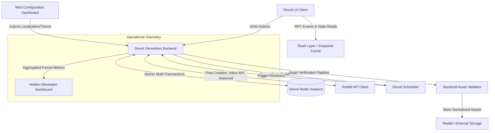
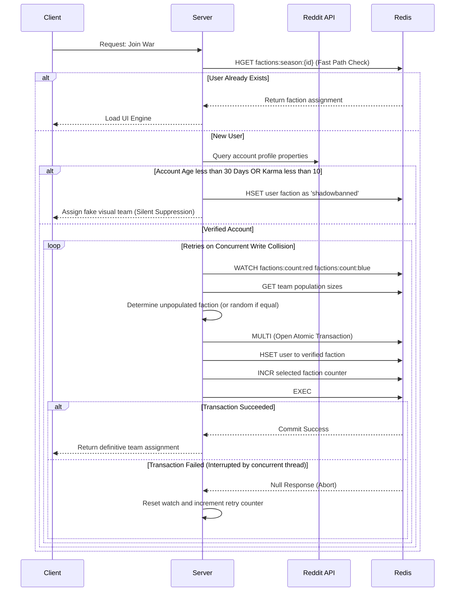
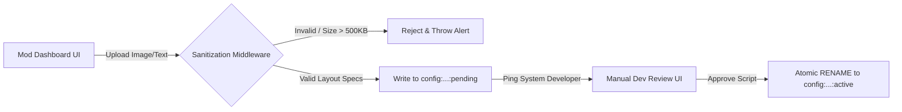

```markdown
# Master Backend Architecture: Devvit Faction Warfare (Enterprise Spec)

This document defines the complete, production-ready serverless backend architecture for an asynchronous, team-based community game deployed on Reddit via Devvit. The system is engineered to handle massive, concurrent traffic spikes, enforce community safety, allow extensive subreddit localization, and maximize Daily Active Users (DAU) to qualify for the Reddit Developer Fund.

---

## 1. System Topology

The system operates entirely within a serverless, decoupled framework. Client read requests are debounced through a snapshot layer to protect against cache stampedes, while state-mutating actions utilize optimistic locking and atomic transactions.



---

## 2. Comprehensive Redis Data Schema

State is aggressively normalized across specific data structures to minimize payload sizes and prevent database locks. Stale historical data is systematically purged via Time-to-Live (TTL) expiries.

| Key | Type | Purpose | Constraints & Expiries |
| --- | --- | --- | --- |
| `config:subreddit:{subredditId}` | `JSON` | Active theme, custom word configurations, and mod pacing controls. | Persistent. Upgraded via Migration Middleware. |
| `config:subreddit:{subredditId}:pending` | `JSON` | Staged theme modifications awaiting developer safety approval. | Cleared upon approval/rejection. |
| `factions:season:{id}` | `HASH` | Maps `userId` to `factionId` (e.g., `red`, `blue`, or `shadowbanned`). | O(1) read latency. |
| `factions:count:{faction}` | `STRING` | Integer counter tracking total verified active players per team. | Altered exclusively via `INCR` / `DECR`. |
| `board:public:{turn}` | `JSON` | Master board state containing words and active flipped tiles. | Ephemeral (7-day TTL). |
| `board:private:{season}` | `JSON` | Solution matrix containing hidden tile designations. | **Never** sent to client. Strictly server-side. |
| `board:snapshot:{turn}` | `JSON` | Flattened, pre-compiled read-state payload for UI client rendering. | Overwritten every 10 seconds to eliminate read load. |
| `votes:{season}:{turn}` | `ZSET` | Ranked index tracking vote weight accumulation per `tile_id`. | Modified atomically via `ZINCRBY`. |
| `has_voted:{season}:{turn}` | `HASH` | Lookup table mapping `userId` to a boolean status. | Prevents double-voting and race conditions. |
| `notifications:{faction}` | `SET` | List of opted-in `userId` tokens for automated direct message pings. | Iterated upon turn change. |
| `stats:global:{userId}` | `JSON` | Persistent cross-season meta-progression, streaks, and trophy keys. | Persistent. Cleared upon GDPR event execution. |
| `metric:funnel:{sub}:{step}` | `STRING` | Aggregated telemetry event counters for optimization auditing. | Reset monthly. |

### Schema Migration Middleware

To deploy live application updates without corrupting data structures in active games, every JSON database object contains a top-level `schema_version` integer. Upon backend initialization, the data passes through a structural parser:

* If the database payload `schema_version` is less than the runtime application version, a mutation script injects the missing parameters with default configurations before exposing the object to the execution context.

---

## 3. Trust Gate & Faction Assignment (Sybil Resistance)

To neutralize bot-driven manipulation and malicious alt-account infiltration, incoming player requests pass through an automated safety gate. If an account is trusted, it is sorted into a team using optimistic locking via a Redis Transaction loop (`WATCH`, `MULTI`, `EXEC`).



---

## 4. Weighted Multi-Tier Word Bank Engine

When initializing a new game board layout, the backend blends global baseline vocabulary with community-specific jokes or sub-reddit cultural elements provided by the moderator config.

```
       [ 25-Tile Board Assembly Line ]
                      |
        +-------------+-------------+
        | 70% Weight                | 30% Weight
        v                           v
  [ Global Pool ]            [ Subreddit Lore Pool ]
  (list:pool:global)         (list:pool:lore:{id})
        |                           |
        | SRANDMEMBER(18)           | SRANDMEMBER(7)
        v                           v
  [ 18 Standard Words ]      [ 7 Community Inside Jokes ]
        |                           |
        +-------------+-------------+
                      |
                      v
             [ Fisher-Yates Shuffle ]
                      |
                      v
         [ board:public JSON Creation ]

```

---

## 5. Self-Healing State Machine & Lifecycle Management

The turn-by-turn game cycle utilizes background automation but enforces self-healing rules to circumvent unexpected runtime errors or community bottlenecks.

### Lazy Evaluation Resolution

Rather than counting on the Devvit Scheduler to fire with absolute consistency, the backend implements lazy evaluation. Every incoming user read/write action evaluates the state clock:

* If `Date.now()` is greater than `turn_end_time` and the current game status in Redis is marked as `ACTIVE`, the backend immediately intercepts the client's thread.
* It executes the turn-resolution calculations, writes the new state, updates the posts, and processes the player's action within the new turn context. This loop isolation guarantees that missed or dropped CRON threads never freeze the game loop.

### The Strike System

To prevent gridlocks caused by rogue or offline game coordinators:

* A team's voting cohort can submit a "Veto Clue" command. If `vetoCount / activePlayers` is greater than `0.2` (20%), the active clue is discarded.
* If a single team triggers two consecutive vetoes during a single turn window, the backend instantly strips command authorization, auto-flips a random neutral tile against that team as an operational penalty, and toggles the phase to the opposing team's turn.

### Infrastructure & Cleanup Hooks

* **Cron Jitter Automation:** To safeguard against hitting global API rate limits (`429 Too Many Requests`) when processing turn changes across hundreds of subreddits concurrently, the Scheduler offsets initialization calls by calculating a variable time buffer: `Delay = Math.random() * 300` seconds.
* **AppUninstall Hook:** Binds directly to the application environment lifecycle. Upon receipt of an uninstallation event, it wipes out all active schedules allocated to the `subredditId` and deletes all transient keys to avoid orphan processes.
* **GDPR Compliance Pipe:** Monitors the global `UserDeleted` server thread. On execution, it runs an asynchronous routine that strips identifying metadata from `stats:global:{userId}` and modifies any active entries within historical leaderboards to `[Deleted User]`.

---

## 6. Dynamic Theme Engine & Asset Pipeline

Moderators initialize a localized interface framework using a multi-stage validation sandbox to guarantee look-and-feel consistency and data safety.



1. **Asset Profiling:** The validation middleware handles incoming image URLs by executing an initial `HEAD` request to enforce size limits (less than 500KB) and verify content types. It then standardizes icons to uniform dimensions (64x64px) to protect the rendering grid from breaking layout styles.
2. **Dynamic Tokens:** The design pipeline dynamically maps text layers to customizable strings. Labels like "Red Team" or "Blue Team" are swapped at runtime with variables stored in `config:subreddit:{id}`, such as "The Light Roasts" or "The Dark Roasts", ensuring the engine can support localized identities seamlessly.

---

## 7. Feed Integration & Operational Engineering

### Cache Stampede Snapshot Mitigation

To handle extreme traffic spikes without exhausting Redis performance, read operations are strictly separated from raw transactional keys:

* Write actions write directly to the primary structural primitives (`votes:{season}:{turn}`).
* Client read requests are systematically restricted to a pre-compiled flat JSON object (`board:snapshot:{turn}`). A scheduled background task regenerates this snapshot every 10 seconds. This approach converts expensive sorting operations into highly efficient O(1) string retrievals, safely handling spikes in traffic.

### Engagement Gating

To comply with Reddit's monetization terms for "Qualified Engagers," the first initialization layout acts as an intentional engagement gateway. The feed element renders a compressed canvas dashboard showing only the overarching team match score alongside an explicit action component: `[ Tap to Enter War Room ]`.

The game board remains unrendered until this interaction takes place, ensuring that every user who enters the game loop triggers a verified click event that registers for the developer fund.

### Post Spawning & Tombstoning

```
[ Turn 4: Active Post ]                    [ Turn 5: Newly Spawned Post ]
+----------------------------+             +----------------------------+
| Game Live!                 |             | Game Live!                 |
| [ Vote on Tile ]           |             | [ Vote on Tile ]           |
+----------------------------+             +----------------------------+
              |                                          ^
              | Turn Resolves                            |
              v                                          |
+----------------------------+                           |
| Tombstoned Component       |                           |
| "Turn 4 Concluded"         |                           |
| [ Go to Live Turn 5 ] -----+---------------------------+
+----------------------------+

```

When a turn window concludes, the old Reddit thread cannot receive new entries. The background Cron job alters the status attribute of the old thread to `RESOLVED`, transforming its active interfaces into static informational components.

Any player opening an outdated thread is presented with a clear redirect overlay: `[ Go to Live Turn ➡️ ]`, which routes them directly to the new post spawned by the Devvit API for the active turn phase.

```

```