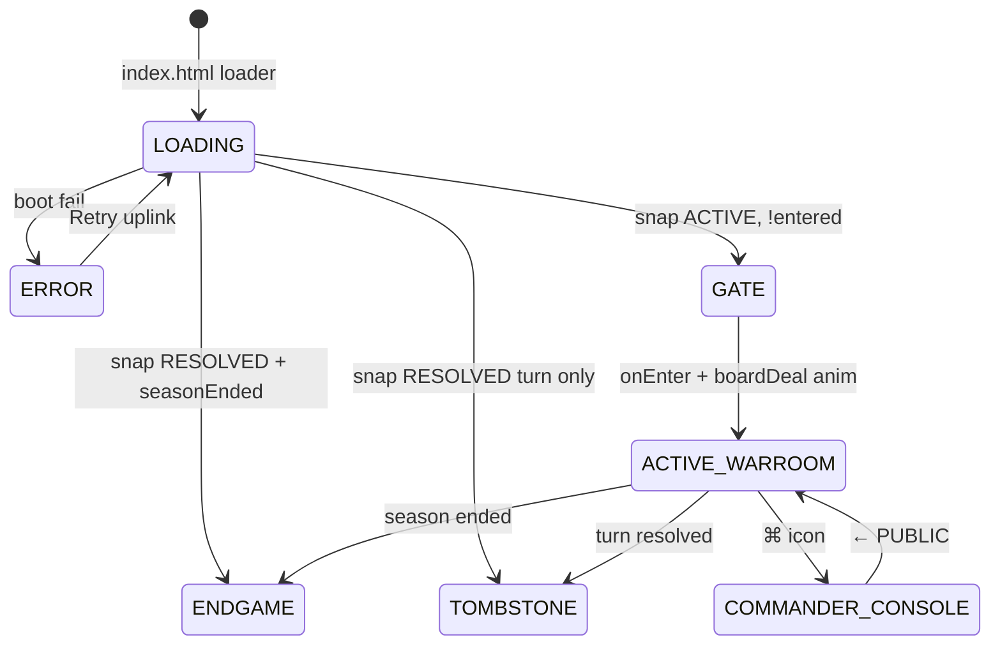

# Faction Warfare — Frontend UI Reference

> **Purpose:** Single document for humans and LLMs to understand, imagine, or recreate the client UI without reading every source file.  
> **Stack:** Devvit Web (Reddit in-feed webview). Vanilla TypeScript + DOM. No React/Vue. One CSS file.  
> **Design language:** **Nano Arcade** — synthwave CRT, Banana/Coconut factions, dark void grid, phosphor teal ink, scanlines.

---

## 1. Mental model

The client is a **route machine** inside `#app.arcade-cabinet`. One screen mounts at a time; **bottom sheets** (vote confirm, commander clue) overlay without unmounting the war room behind them.

```
index.html (#app.arcade-cabinet)
    └── main.ts          boot, state, render(), realtime, countdown
            ├── components/*   screen renderers (return HTMLElement trees)
            ├── endgame.ts     variant resolution, stats panel, overlay builder
            ├── audio.ts       Web Audio 8-bit SFX
            ├── theme/ui.ts    Pop UI composables (popScreen, popBtn, …)
            ├── theme/tokens.ts → CSS custom properties (--nano-*)
            ├── dom.ts         el() helper
            ├── api.ts         /api/* fetch wrappers
            └── styles.css     Nano Arcade + endgame FX (~1900 lines)
```

**Data in:** `GET /api/init` → `ClientSession` + `BoardSnapshot` + `playerStats` + theme  
**Live updates:** Devvit `connectRealtime` on `fw_{postId}` + 12s poll fallback + 1s countdown tick on `.pop-bar__time`

---

## 2. Route flow



| Route | Component | When |
|-------|-----------|------|
| `LOADING` | inline loader in `index.html` | until `boot()` first `render()` |
| `ERROR` | `renderError()` in `main.ts` | `state.error` or bad session |
| `GATE` | `GateView` | active game, user hasn't tapped enter |
| `ACTIVE_WARROOM` | `ActiveWarroom` | main play surface |
| `COMMANDER_CONSOLE` | `CommanderConsole` | classified x-ray board |
| `TOMBSTONE` | `TombstoneView` | turn resolved, season continues |
| `ENDGAME` | `EndgameView` | season ended (win/loss/glitch/stalemate) |

**Endgame variants** (`resolveEndgameVariant`):

| Variant | Trigger | Overlay state |
|---------|---------|---------------|
| `victory` | viewer = winner (incl. assassin winner) | `WIN` |
| `defeat` | viewer lost | `LOSS` + CRT shutdown |
| `assassin` | virus flipped, viewer lost | `GLITCH` |
| `stalemate` | full board, equal captures | `STALEMATE` |

**RETRY:** `GET /api/retry-target` → live war room post if mod spawned one, else subreddit feed.

**Audio:** `warmupAudio()` on gate enter; `playEndgameSfx()` on endgame mount (`sfx_victory_fanfare`, `sfx_crt_shutdown`, `sfx_low_buzz`).

**Overlay layers (not routes):**

| Layer | Component | Trigger |
|-------|-----------|---------|
| Vote sheet | `VoteConfirmSheet` | tile tap → `state.pendingTile` |
| Clue sheet | `renderCommanderClueSheet` | `state.cluePanelOpen` on commander route |
| Toast | `.toast` on `document.body` | `flash(message)` errors |
| Screen flash | `#app.arcade-flash--vote\|clue` | after vote / successful clue |
| Endgame glitch | `#app.arcade-endgame-glitch` | 0.5s before endgame mount |

---

## 3. File map

| Path | Role |
|------|------|
| `src/client/index.html` | Shell: viewport lock, `#app`, boot loader |
| `src/client/main.ts` | Global `UiState`, `render()`, actions, boot |
| `src/client/dom.ts` | `el(tag, attrs, children)` DOM builder |
| `src/client/api.ts` | Typed REST client |
| `src/client/styles.css` | Nano Arcade + endgame FX (~1900 lines) |
| `src/client/theme/tokens.ts` | `POP` constants, `applyThemeTokens()`, CSS var injection |
| `src/client/theme/ui.ts` | Composable UI primitives |
| `src/client/components/GateView.ts` | Entry / attract screen |
| `src/client/components/ActiveWarroom.ts` | Header + 5×5 board + clue HUD |
| `src/client/components/GridTile.ts` | Single board cell button |
| `src/client/components/VoteConfirmSheet.ts` | Bottom vote confirmation |
| `src/client/components/CommanderConsole.ts` | X-ray board + clue sheet |
| `src/client/components/TombstoneView.ts` | Resolved turn card |
| `src/client/components/EndgameView.ts` | Season-end CRT takeover |
| `src/client/endgame.ts` | Variant + stats + overlay API |
| `src/client/audio.ts` | Web Audio synth SFX |
| `src/client/forms/commanderForm.ts` | Clue form copy strings |
| `src/shared/theme.ts` | Theme resolution, faction helpers (shared w/ server) |
| `src/shared/types.ts` | `BoardSnapshot`, `PublicTile`, `RouteState`, … |
| `src/shared/strings.ts` | `formatRemaining()` countdown text |

---

## 4. Global UI state (`main.ts`)

```typescript
interface UiState {
  session: ClientSession | null;
  snapshot: BoardSnapshot | null;
  theme: ThemeTokens;
  entered: boolean;              // passed gate?
  route: RouteState;
  votedTileId: string | null;    // optimistic lock after vote
  busy: boolean;               // API in flight
  error: string | null;
  pendingTile: { id: string; word: string } | null;
  xrayTiles: XrayTile[] | null;
  xrayLoading: boolean;
  cluePanelOpen: boolean;
  boardDeal: boolean;            // one-shot 900ms deal-in animation
}
```

**Render strategy:** full `root.replaceChildren(view)` per route change. War room vote sheet uses `syncActionSheet()` to append `#action-sheet` without remounting when same tile. `renderWarroomIfMounted()` refreshes board only when dismissing sheet.

---

## 5. Design system — Nano Arcade

### 5.1 Aesthetic keywords

- **Cabinet:** full-viewport void `#050014`, CRT scanlines + vignette on `#app.arcade-cabinet`
- **Synth UI:** 2px phosphor borders, neon glow shadows (`--nano-glow`), monospace type
- **Type:** `ui-monospace`, weight 700–900, uppercase, wide letter-spacing on eyebrows
- **Faction colors:** Banana `#FAED27` (red team), Coconut `#FF5500` (blue team), Virus `#FF0055` (assassin), Neutral `#555555`
- **Motion:** CRT flicker, chroma split on endgame marquee, staggered tile deal; `prefers-reduced-motion` disables all

Legacy `pop-*` class names remain in DOM/CSS; they alias `--nano-*` tokens via `styles.css`.

### 5.2 Default palette (`defaultTheme()` / `NANO`)

| Token | CSS var | Default | Usage |
|-------|---------|---------|--------|
| void | `--nano-void` | `#050014` | Screen backgrounds |
| grid | `--nano-grid` | `#1A0033` | Cards, panels |
| tile | `--nano-tile` | `#111111` | Open tile face |
| phosphor | `--nano-phosphor` | `#00FFFF` | Ink, borders, glow |
| banana | `--nano-banana` | `#FAED27` | Banana faction |
| coconut | `--nano-coconut` | `#FF5500` | Coconut faction |
| neutral | `--nano-neutral` | `#555555` | Neutral flipped tiles |
| virus | `--nano-virus` | `#FF0055` | Assassin / defeat accent |
| wire | `--nano-wire` | `#333333` | Grid lines |

**Legacy aliases:** `--pop-pink` → banana, `--pop-green` → coconut, `--pop-orange` → virus, `--pop-ink` → phosphor.

**Spacing:** xs 4 / sm 8 / md 12 / lg 16 / xl 24 px  
**Radius:** sm 4px, lg 8px, pill 999px  
**Shadows:** `--pop-shadow-toy`, `--pop-shadow-sheet` (neon glow from phosphor)

Subreddit config can override colors + labels via `applyThemeTokens(theme)` on boot.

### 5.3 Default copy labels

| Key | Default |
|-----|---------|
| `gameTitle` | Faction Warfare |
| `enterCta` | Enter Command Center |
| `redTeam` | Banana Faction |
| `blueTeam` | Coconut Faction |
| `redTag` | Banana |
| `blueTag` | Coconut |

---

## 6. Layout primitives (`theme/ui.ts`)

All screens build from these helpers:

| Helper | Renders | Key classes |
|--------|---------|-------------|
| `popScreen(bg, children)` | Full-height column | `pop-screen pop-screen--{sky\|xray\|muted\|white}` |
| `popStack(children)` | Centered column, max 420px | `pop-stack` |
| `popCard(children)` | White bordered panel | `pop-card` |
| `popTitle(text, size?)` | H1 uppercase | `pop-title`, `pop-title--xl` |
| `popHeading(text)` | H2 | `pop-heading` |
| `popBody(text)` | Paragraph | `pop-body`, modifiers `--center`, `--muted`, `--warn`, `--meta` |
| `popEyebrow(text)` | Small label | `pop-eyebrow` |
| `popBtn(label, opts)` | Button | `pop-btn pop-btn--{primary\|secondary\|ghost}` + `--pink`/`--green` |
| `popBadge(faction, score, tag, active)` | Header score chip | `pop-badge pop-badge--pink\|green` |
| `popScorePill(...)` | Gate score row | `pop-score-pill` |
| `popFactionPill(text, faction)` | Colored assignment pill | `pop-faction-pill` + `--pop-accent` |
| `popBoard(children)` | 5×5 grid | `pop-board board` |
| `popBar(children)` | War room header | `pop-bar warroom__bar` |
| `popClueHud(children)` | Floating clue bar | `pop-clue pop-clue--live` |
| `popSheet(children)` | Bottom sheet | `pop-sheet pop-sheet--open` |
| `popField(attrs)` | Text/number input | `pop-field` |
| `popIconBtn(...)` | Round ⌘ button | `pop-icon-btn bar-cmd` |

---

## 7. Screens (wireframes + behavior)

### 7.1 Boot loader (`index.html`)

```
┌─────────────────────────────┐
│     (sky blue full bleed)    │
│                              │
│         ◉ pulsing dot        │  loader__pulse — pink circle
│                              │
│   ESTABLISHING UPLINK_       │  loader__text--arcade, blinking cursor
│                              │
└─────────────────────────────┘
```

Replaced entirely when `main.ts` first `render()` runs.

---

### 7.2 Gate — `GateView` (`pop-screen--center pop-screen--arcade-gate`)

Attract mode before entering war room. **All text uppercase** in UI.

```
┌─────────────────────────────┐
│ ░░ sky + subtle grid/stars ░░│
│                              │
│        INSERT COIN           │  pop-eyebrow--coin (pink blink)
│                              │
│        FACTION               │  split title: large line + smaller line
│        WARFARE               │  pop-title--arcade neon pulse
│                              │
│   ┌─────────────────────┐   │
│   │ PINK: 8  |  GREEN: 7 │   │  pop-score-pill
│   └─────────────────────┘   │
│                              │
│   ┌ YOU ARE PINK FACTION ┐    │  pop-faction-pill (faction color)
│                              │
│   Vote tiles with your...    │  pop-body--center
│                              │
│   ┌─────────────────────┐   │
│   │ ENTER COMMAND CTR   │   │  pop-btn--cta pop-btn--arcade (pulse)
│   └─────────────────────┘   │
│                              │
│   42 ALLIES DEPLOYED         │  pop-body--meta (if trusted)
│   or NEW ACCOUNT — OBSERVE…  │  pop-body--warn (if !trusted)
└─────────────────────────────┘
```

**Interactions:** CTA → `onEnter()` → `entered=true`, `route=ACTIVE_WARROOM`, `triggerBoardDeal()`.

**Logged-out copy:** "Log in to Reddit to enlist…" — button still shown; voting disabled later.

---

### 7.3 Active war room — `ActiveWarroom` (`warroom warroom--arcade`)

Primary gameplay screen. **5×5 board** fills remaining vertical space via container queries.

```
┌─────────────────────────────┐
│ ┌PINK┐  4m 12s left  ┌GREEN┐ │  pop-bar
│ │ 8  │  T3 · PINK MOVE │ 7  │ │  active badge glows
│ └────┘                 └────┘⌘│  ⌘ only if active faction + trusted
├─────────────────────────────┤
│      ┌ CLUE OCEAN × 2 ┐       │  pop-clue--live (if activeClue)
│      └────────────────┘       │
│  ┌───┬───┬───┬───┬───┐       │
│  │WRD│WRD│WRD│WRD│WRD│       │  grid-tile buttons
│  ├───┼───┼───┼───┼───┤       │  gap 5px, aspect-ratio 1
│  │   │ 2 │   │   │   │       │  vote badge top-right
│  │   │   │   │   │   │       │
│  └───┴───┴───┴───┴───┘       │
│         (centered stage)       │
└─────────────────────────────┘
```

**Header meta line:** `{active\|enemy} MOVE` from `session.isActiveFaction`.  
**Countdown:** `.pop-bar__time` updated every 1s via `formatRemaining(turnEndTime)`.

**Board rules (`GridTile`):**

| State | Classes | Look |
|-------|---------|------|
| Open, votable | `grid-tile grid-tile--open` | White face, pointer, subtle white outline |
| Open, disabled | + `:disabled` | 55% opacity |
| Pending confirm | `grid-tile--pending` | 3px ring `--vote-color`, pulse anim |
| Voted (optimistic) | `grid-tile--voted` | Same ring, lock anim |
| Flipped red/blue/assassin | `grid-tile--flipped` + `data-role` | Solid faction color, white word |
| Flipped neutral | `data-role=neutral` | Grey face |
| Vote count > 0 | `.grid-tile__votes` badge | Small pill, faction color bg |

**Deal-in:** on gate enter, `pop-board--deal` adds staggered `arcade-tile-deal` (22ms × tile index via `--tile-i`).

**Can vote when:** logged in + trusted + active faction + ACTIVE status + no `votedTileId`.

---

### 7.4 Vote confirm sheet — `VoteConfirmSheet`

Fixed bottom overlay. **No backdrop scrim** — board stays visible.

```
┌─────────────────────────────┐
│  (war room still visible)     │
│                              │
├─────────────────────────────┤
│        ─── handle            │
│  ← BACK                      │
│      CAST YOUR VOTE            │  eyebrow in faction color
│                              │
│        OCEAN                   │  pop-heading = tile word
│                              │
│  ┌ LOCK IN OCEAN ─────────┐  │  primary, faction color
│  │ VETO COMMANDER'S CLUE  │  │  ghost, if activeClue exists
│  │ NEVER MIND            │  │  secondary
│  └───────────────────────┘  │
└─────────────────────────────┘
```

Anim: `arcade-sheet-in` — slide up with overshoot.  
IDs: `#action-sheet` (optional `data-tile-id` for reuse).

---

### 7.5 Commander console — `CommanderConsole`

Full screen replacement. Shows **solution board** with all roles visible (x-ray tiles, not buttons).

```
┌─────────────────────────────┐
│ ← PUBLIC    CLASSIFIED X-RAY · T3 │
├─────────────────────────────┤
│  (same 5×5 grid layout)     │
│  each tile colored by role  │  xray-tile[data-role]
│  subtle CRT flicker anim    │
├─────────────────────────────┤
│  ┌ ISSUE COMMAND ─────────┐ │  dock button (if commander)
│  └────────────────────────┘ │
└─────────────────────────────┘
```

**Not commander:** centered "COMMANDER SEAT EMPTY" + `TAKE COMMAND`.  
**Loading:** "SCANNING BOARD…" while `GET /api/commander-xray`.  
**Clue sheet:** same bottom sheet pattern as vote (`#commander-clue-sheet`).

Clue form fields:
- Word: text, max 24, uppercase styling
- Count: number 0–9, default 1, narrow 64px field
- Copy from `COMMANDER_CLUE_FORM` in `forms/commanderForm.ts`

---

### 7.6 Tombstone — `TombstoneView` (`pop-screen--muted`)

Archive view when `snap.status === 'RESOLVED'`.

```
┌─────────────────────────────┐
│     (muted blue-grey bg)     │
│   ┌─────────────────────┐   │
│   │  LEVEL CLEARED      │   │
│   │  TURN RESOLVED.     │   │
│   │  {ticker message}   │   │
│   │  JUMP TO LIVE TURN ➡│   │  or "AWAITING THE NEXT FRONT…"
│   └─────────────────────┘   │
└─────────────────────────────┘
```

Jump uses Devvit `navigateTo(reddit post URL)`.

---

### 7.7 Error — `renderError()` in `main.ts`

Same layout as tombstone but `pop-card--error` (virus border), title "Signal lost", retry button.

---

### 7.8 Endgame — `EndgameView` / `renderEndgameOverlay` (`endgame.ts`)

Full-screen CRT takeover when `snap.seasonEnded`. 0.5s `#app.arcade-endgame-glitch` precedes mount.

```
┌─────────────────────────────┐
│ ░░ void + scanlines + vignette ░░│
│  ═══ SCROLLING MARQUEE ═══   │  .endgame-marquee (variant color)
│                              │
│     ┌ 5×5 recap grid ┐       │  .endgame-grid (flipped tiles only)
│     │  + emblem     │       │  .endgame-emblem--hero
│     └───────────────┘       │
│                              │
│   ┌ POST-GAME STATS ────┐   │  .stats-panel
│   │ tiles / time / eff  │   │
│   │ career W-L-streak   │   │  .stats-panel__item--career
│   └─────────────────────┘   │
│                              │
│   ┌ RETRY ──────────────┐   │  pop-btn + neon-bz-bzz hover
│   └─────────────────────┘   │  → GET /api/retry-target
└─────────────────────────────┘
```

| Variant | Marquee class | Overlay state | SFX |
|---------|---------------|---------------|-----|
| `victory` | `--victory` | `WIN` | `sfx_victory_fanfare` |
| `defeat` | `--defeat` | `LOSS` | `sfx_crt_shutdown` |
| `assassin` (loser) | `--assassin` | `GLITCH` | `sfx_low_buzz` |
| `stalemate` | `--stalemate` | `STALEMATE` | `sfx_low_buzz` |

Assassin **winner** maps to `victory` / `WIN` (not glitch).

Defeat adds `.arcade-overlay--crt-shutdown` (scan collapse animation).

**Career stats** from `session.playerStats` (`PlayerStatsSummary`: wins, losses, currentStreak, bestStreak).

---

## 8. Tile role colors (flipped / x-ray)

| `data-role` | Background | Text |
|-------------|------------|------|
| `red` | `--pop-pink` | white + shadow |
| `blue` | `--pop-green` | white + shadow |
| `neutral` | `--pop-grey` | ink |
| `assassin` | `--pop-orange` | white + shadow |

Open (unflipped) tiles stay **white** with ink text — votes show as **ring + badge**, not full heatmap fill.

---

## 9. CSS class reference (grouped)

### App shell
- `.app` — flex column, 100dvh, overflow hidden
- `.arcade-cabinet::before/::after` — vignette + scanlines (z 8999–9000)

### Screens
- `.pop-screen`, `.pop-screen--sky|xray|muted|white|center|arcade-gate`

### War room
- `.warroom`, `.warroom__body`, `.warroom__stage`, `.warroom__bar`
- `.pop-board`, `.pop-board--deal`

### Tiles
- `.grid-tile`, modifiers `--open`, `--flipped`, `--pending`, `--voted`
- `.grid-tile__word`, `.grid-tile__votes`
- `.xray-tile`, `.xray-tile__word`

### Sheets
- `.pop-sheet`, `.pop-sheet--open`, `.pop-sheet--commander`
- `.pop-sheet__handle`, `__head`, `__back`, `__eyebrow`, `__actions`, `__fields`

### Commander
- `.commander-console`, `__header`, `__title`, `__body`, `__empty`, `__dock`, `__stage`

### Endgame
- `.endgame-screen`, `.endgame`, `.endgame-marquee`, `.endgame-grid`, `.endgame-stage`
- `.arcade-overlay`, `.arcade-overlay--crt-shutdown`
- `.stats-panel`, `.stats-panel__item`, `.stats-panel__item--career`
- `.border-glow`, `.border-glow--live` (tile neon ring)
- `.arcade-endgame-glitch` (pre-mount flash)

### Feedback
- `.toast`, `.toast--show`
- `.arcade-flash--vote`, `.arcade-flash--vote::before` (pink radial flash)
- `.arcade-flash--clue` (green flash)

---

## 10. Animation catalog

| Class / trigger | Effect | Duration |
|-----------------|--------|----------|
| `loader__pulse` | scale pulse | 1.1s loop |
| `pop-screen--arcade-gate .pop-stack` | rise in | 0.55s once |
| `pop-eyebrow--coin` | opacity blink | 1.1s |
| `pop-title--arcade` | neon brightness | 2.4s |
| `pop-btn--arcade` | CTA float + glow | 1.8s |
| `pop-badge--active` | glow ring | 1.5s |
| `pop-board--deal > .grid-tile` | deal from above | 0.42s staggered |
| `grid-tile--pending` | ring pulse | 0.55s |
| `grid-tile--voted` | scale lock | 0.35s |
| `pop-sheet--open` | sheet bounce in | 0.42s |
| `pop-clue--live` | drop + neon | 0.45s + 2s |
| `xray-tile` | flicker | 3.5s staggered |
| `#app.arcade-flash--*` | fullscreen flash | 0.32s |
| `.arcade-endgame-glitch` | RGB shift static | 0.5s |
| `.endgame-marquee__track` | horizontal scroll | 14s loop |
| `.endgame-marquee--victory` | chroma split | 0.12s |
| `.endgame-emblem--hero` | pulse glow | 1.6s |
| `.arcade-overlay--crt-shutdown` | CRT collapse | ~1.2s |
| `.neon-bz-bzz` (RETRY hover) | buzz flicker | 0.08s steps |

All disabled under `@media (prefers-reduced-motion: reduce)`.

---

## 11. DOM builder (`dom.ts`)

```typescript
el('div', { class: 'foo', onclick: handler, 'data-id': 'x' }, ['text', childNode])
```

- `class` → `className`
- `on*` → event listeners
- `aria-*`, `role`, `data-*` → attributes
- Other keys → DOM properties

No virtual DOM. Full re-render on snapshot hash change is cheap (small tree).

---

## 12. API surface (client → server)

| Method | Path | UI trigger |
|--------|------|------------|
| GET | `/api/init` | boot |
| GET | `/api/state` | poll 12s |
| POST | `/api/vote` `{ tileId }` | vote sheet confirm |
| POST | `/api/veto` | vote sheet veto |
| POST | `/api/clue` `{ word, count }` | commander clue sheet |
| POST | `/api/claim-commander` | TAKE COMMAND |
| GET | `/api/retry-target` | endgame RETRY button |
| GET | `/api/commander-xray` | open commander console |

---

## 13. Board data shape (what UI reads)

```typescript
// 25 tiles, row-major
PublicTile: { id, word, voteCount, isFlipped, revealedRole? }

BoardSnapshot: {
  turn, status, currentFaction, turnEndTime,
  scores: { red, blue },        // remaining tiles to win
  tiles: PublicTile[25],
  ticker: string,
  activeClue?: { word, count, faction, ... },
  versionHash, livePostId?, nextPostId?,
  seasonEnded?, endReason?, winner?, endgameStats?, seasonStartedAt?
}

ClientSession: {
  visualFaction, trusted, loggedIn,
  isActiveFaction, isCommander, factionPopulation,
  playerStats?: PlayerStatsSummary, ...
}
```

---

## 14. Mobile / embed constraints

- Viewport: `width=device-width, maximum-scale=1, user-scalable=no`
- `overflow: hidden` on html/body — single-screen app
- `touch-action: manipulation`, tap highlight off
- Bottom sheet: `safe-area-inset-bottom` padding
- Board sizing: `container-type: size` on stage, `min(100cqw, 100cqh)` square grid
- Tile words: `clamp(5px, 10cqmin, 11px)`, max 2 lines, break anywhere

---

## 15. Recreate checklist (for LLMs)

To rebuild this UI from scratch:

1. **Shell:** Full-viewport void `#050014`, `#app` flex column, scanline + vignette overlay.
2. **Typography:** Monospace, 900 weight titles, uppercase eyebrows with wide tracking.
3. **Controls:** 2px phosphor border, neon glow shadow, active state dim + translate.
4. **Gate:** Center stack — coin eyebrow, split neon title, score pill, faction pill, CTA.
5. **War room:** Header `[banana badge | timer+meta | coconut badge | ⌘]`, floating clue chip, 5×5 dark tiles with `.border-glow`.
6. **Tiles:** Words centered; flipped = solid role color + live glow; votes = corner badge + pending ring.
7. **Sheets:** Grid panel from bottom, handle bar, no dimmer behind.
8. **Endgame:** Marquee + recap grid + stats panel + RETRY; variant-specific SFX + CRT shutdown on defeat.
9. **Theme:** CSS variables from config; banana/coconut labels in HUD (internal keys still red/blue).
10. **Motion:** CRT flicker, chroma marquee; respect reduced motion.
11. **State machine:** Gate → war room → commander → tombstone/endgame; sheets as siblings on `#app`.

---

## 16. Related server docs

Theme persistence and legacy palette migration live in `src/shared/theme.ts` (server applies same tokens on init). Board logic is server-side; client is display + vote/clue actions only.

---

*Generated from source at `src/client/` — update this doc when adding screens or Pop components.*
