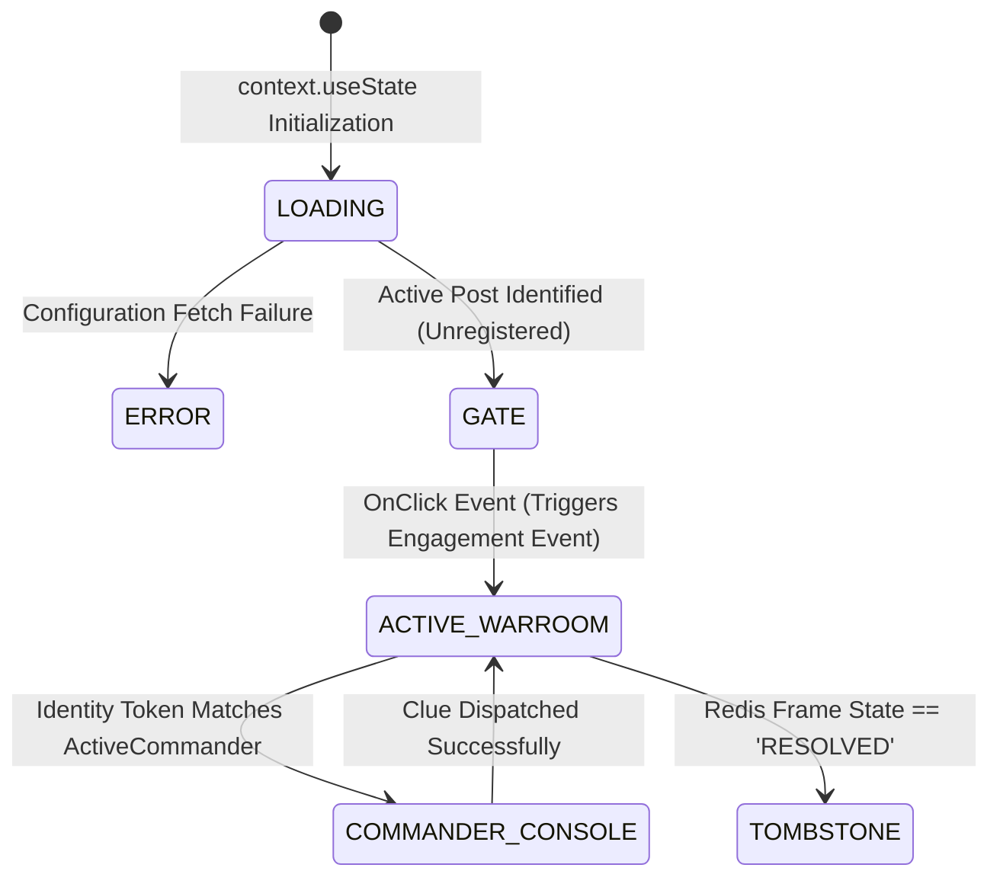

```markdown
# Master Frontend Architecture: Devvit Faction Warfare (Enterprise Spec)

This document outlines the structured, modular frontend architecture for the Faction Warfare game built on the Reddit Devvit developer platform. It guarantees strict type-safety, high-efficiency client-side rendering via Devvit Blocks, mobile view-budget compliance, and cross-compatibility between desktop and the native Reddit iOS/Android application shells.

---

## 1. Project Directory Structure

To maintain a clean separation of concerns and enable frictionless feature expansion (e.g., sound engines, localization, mini-shops), the codebase enforces a modular, domain-driven file structure:


```

src/
├── main.tsx                # App entry point, Devvit custom triggers & installation register
├── manifest.json           # Reddit application metadata & permissions profile
├── components/             # UI Presentation Layer (Atomic Design)
│   ├── ActiveWarroom.tsx   # Core gameplay state engine container
│   ├── CommanderConsole.tsx# Custom configuration suite for the phase coordinator
│   ├── GateView.tsx        # Entry portal component (The Qualified Engager wrapper)
│   ├── TombstoneView.tsx   # Legacy archive container with deep redirect hooks
│   └── common/             # Reusable Atomic UI Elements
│       ├── GridTile.tsx    # Tactile 3D grid button layout
│       ├── Header.tsx      # Multi-faction scoreboard component
│       └── NewsTicker.tsx  # Dynamic string scrolling ticker
├── hooks/                  # Custom Hooks (Isolated State Hooks & Logic Business)
│   ├── useGameState.ts     # Bundles optimistic updates & error fallbacks
│   └── useSyncInterval.ts  # Staggered polling fetch machine
├── styles/                 # Visual Design Tokens
│   └── themeEngine.ts      # Custom skin evaluation logic
└── utils/                  # Stateless Helper Utilities
├── validators.ts       # Text input formatting checks
└── stringHelpers.ts    # Label truncation & conversion tools

```

---

## 2. Client-Side Lifecycle Route Machine

Because Devvit components cannot execute arbitrary client-side routing libraries, navigation is handled via an explicit state token evaluated at the root level of the application shell.



---

## 3. Core Component Layout Blueprint

### File: `src/components/common/GridTile.tsx`

Encapsulates individual tile interaction targets, visual haptic styling layers, text overflow management, and real-time community vote counting within an isolated atom.

```tsx
import { Devvit } from '@devvit/public-api';

interface GridTileProps {
  tile: { id: string; word: string; voteCount: number; isFlipped: boolean };
  themeBg: string;
  themeText: string;
  onVote: (id: string) => void;
}

export const GridTile = ({ tile, themeBg, themeText, onVote }: GridTileProps): JSX.Element => {
  return (
    <zstack width="19%" height="65px" alignment="center middle">
      {/* Visual Base Layer: Color states mapped from Theme Configuration */}
      <vstack 
        width="100%" 
        height="100%" 
        cornerRadius="small"
        padding="xsmall"
        alignment="center middle"
        backgroundColor={themeBg}
      >
        {/* Enforce strict overflow constraints to stop UI clipping on mobile screens */}
        <text size="xsmall" weight="bold" color={themeText} overflow="ellipsis">
          {tile.word.toUpperCase()}
        </text>
        
        {/* Dynamic Vote Density Display */}
        {tile.voteCount > 0 && (
          <hstack alignment="center middle" padding="top xsmall">
            <text size="xxsmall" color="neutral-content-weak">
              🔥 {tile.voteCount}
            </text>
          </hstack>
        )}
      </vstack>
      
      {/* Top Layer Transparent Click Target: Activated exclusively on un-flipped boards */}
      {!tile.isFlipped && (
        <button
          width="100%"
          height="100%"
          appearance="transparent"
          onPress={() => onVote(tile.id)}
        />
      )}
    </zstack>
  );
};

```

### File: `src/components/ActiveWarroom.tsx`

Constructs the overarching gameplay interface by grouping atomic presentation blocks into a mathematical 5x5 structural loop.

```tsx
import { Devvit } from '@devvit/public-api';
import { GridTile } from './common/GridTile.tsx';
import { useGameState } from '../hooks/useGameState.ts';
import { resolveThemeTokens } from '../styles/themeEngine.ts';

interface WarroomProps {
  context: Devvit.Context;
  subConfig: any;
}

export const ActiveWarroom = ({ context, subConfig }: WarroomProps): JSX.Element => {
  const { boardState, handleVote } = useGameState(context);
  const theme = resolveThemeTokens(subConfig);

  // Split baseline single-array into multi-row structures
  const coordinateArrays = [0, 1, 2, 3, 4];

  return (
    <vstack width="100%" maxWidth="600px" gap="small" alignment="center middle">
      {coordinateArrays.map((row) => (
        <hstack key={`row-${row}`} width="100%" gap="xsmall" alignment="center middle">
          {coordinateArrays.map((col) => {
            const linearIndex = row * 5 + col;
            const tile = boardState.tiles[linearIndex];

            return (
              <GridTile
                key={tile.id}
                tile={tile}
                themeBg={theme.primaryBg}
                themeText={theme.textColor}
                onVote={handleVote}
              />
            );
          })}
        </hstack>
      ))}
    </vstack>
  );
};

```

---

## 4. Custom Hooks State Infrastructure

### File: `src/hooks/useGameState.ts`

Manages the application's transaction layer, updating local client variables instantly before rolling back modifications seamlessly if network infrastructure encounters collisions.

```typescript
import { Devvit } from '@devvit/public-api';

interface BoardState {
  tiles: Array<{ id: string; word: string; voteCount: number; isFlipped: boolean }>;
  versionHash: string;
}

export function useGameState(context: Devvit.Context) {
  const [boardState, setBoardState] = context.useState<BoardState>({ tiles: [], versionHash: '' });
  const [hasVoted, setHasVoted] = context.useState<boolean>(false);

  const handleVote = async (tileId: string) => {
    if (hasVoted) return;

    // Snapshot current state vector to facilitate effortless rollback execution
    const stateRollbackBackup = { ...boardState };

    // Apply instantaneous Optimistic Update
    const mutatedTiles = boardState.tiles.map((tile) => 
      tile.id === tileId ? { ...tile, voteCount: tile.voteCount + 1 } : tile
    );
    setBoardState({ ...boardState, tiles: mutatedTiles });
    setHasVoted(true);

    // Dispatch Asynchronous Server RPC Transaction Execution
    try {
      const dispatchTransaction = await context.useChannel.sendExecutionEvent('submitVote', { tileId });
      if (!dispatchTransaction.success) throw new Error("Transaction rejected by server validation pipeline");
    } catch (networkError) {
      // Revert local data context states silently if backend handshake fails
      setBoardState(stateRollbackBackup);
      setHasVoted(false);
      context.ui.showToast("Sync failure. Network channel busy.");
    }
  };

  return { boardState, handleVote };
}

```

---

## 5. Client Rendering Constraints & Standards

* **Fixed Height Viewport Scaling:** To prevent layout elements from clipping inside native mobile feeds, all custom wrappers enforce explicit heights. View vertical footprints must use percentage-relative or clamped scale blocks, never pushing beyond a strict budget.
* **The Desktop Guard Layout:** On web browser contexts, Devvit blocks stretch horizontally. The main container utilizes a strict constraint pattern (`maxWidth="600px"` paired with `alignment="center"`) to ensure rendering layout preservation on widescreen formats.
* **Decoupled Theming Rules:** Raw styling specifications (e.g., specific hex color entries, pixel definitions) are stripped from structural layouts. Components fetch configuration variables exclusively via properties returned by `resolveThemeTokens(subConfig)`, ensuring flawless cross-subreddit dynamic branding consistency.

```

```